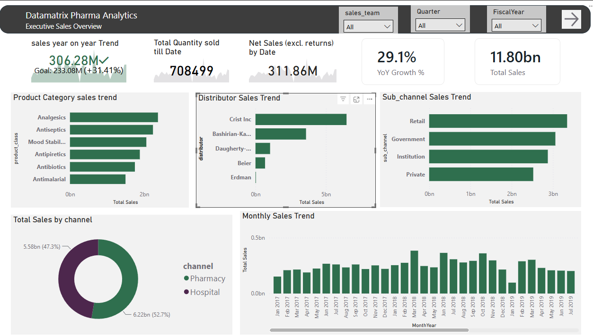
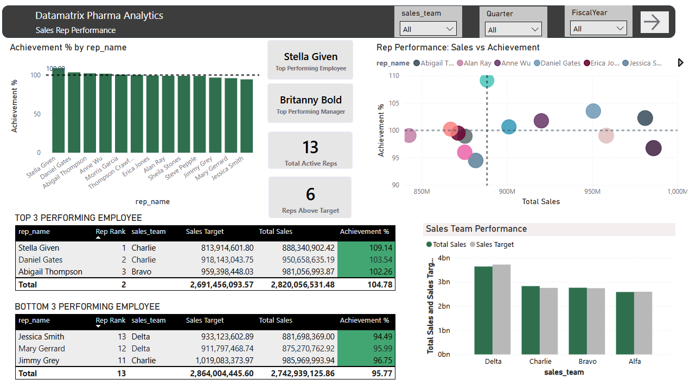
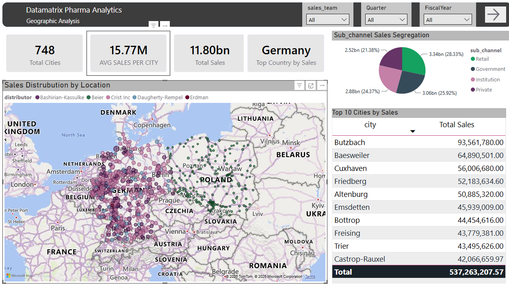
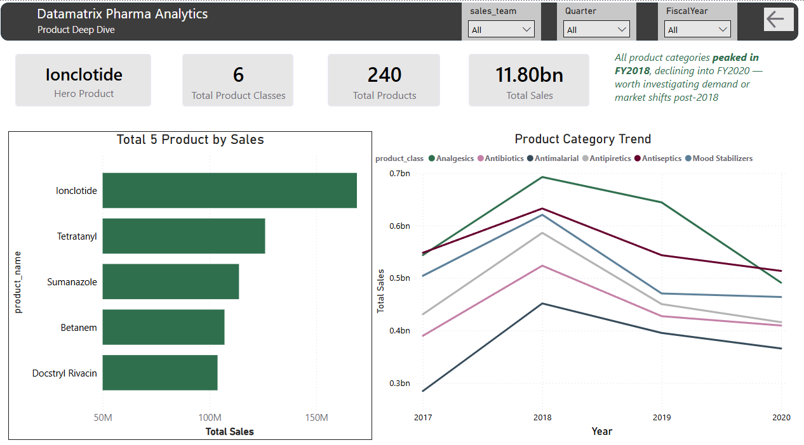

# Datamatrix Pharma Analytics — Sales Force Performance & Territory Analysis

A ZS Associates-style commercial analytics dashboard built in Power BI on a MySQL star schema backend, analyzing pharmaceutical sales performance across sales reps, territories, and product lines — built as a placement portfolio project targeting Data Analyst roles at ZS Associates and similar pharma commercial analytics firms.

`Power BI` `MySQL` `DAX` `Star Schema`

---

## Executive Summary

**SITUATION**
Datamatrix's pharma sales organization runs 13 active reps across 3 sales teams (Delta, Charlie, Bravo, Alfa), covering 748 cities in 2 countries, generating 11.80bn in total sales across 240 products in 6 therapeutic categories.

**COMPLICATION**
Raw sales totals alone don't show whether revenue is being driven by a few reps carrying the team or a genuinely well-distributed sales force — and a flat, static sales target hides whether a rep is under-target because of a weak territory or because expectations were never adjusted for their own prior-year growth. Product-level trend data also showed all 6 categories peaking around FY2018 and declining into FY2020 — a pattern that a single "Total Sales" KPI would completely mask.

**RESOLUTION**
Rebuilding "Sales Target" as a dynamic measure (prior-year sales scaled by company-wide YoY growth, not a static number) exposed genuine over/under performers instead of artificially forcing every rep toward ~100% achievement. A quadrant scatter (Total Sales vs Achievement %) then separated reps into four actionable groups — high-volume high-achievers, small-territory over-achievers, big-territory under-achievers needing coaching, and reps needing broader intervention — the same segmentation logic used in sales force effectiveness (SFE) analysis.

---

## Overview

**Total Sales: 11.80bn | 748 Cities | 2 Countries | 240 Products across 6 Categories | 13 Active Reps**

The dashboard is built around four connected views, designed to move from a high-level executive summary down to individual sales rep and product-level detail — the same drill pattern used in commercial pharma analytics teams to go from "what happened" to "who/what is driving it."

## Dashboard Pages

### 1. Executive Sales Overview
Total sales vs. goal, YoY growth, product category and distributor trends, channel split (Pharmacy vs Hospital), and a monthly sales trend corrected to a true chronological sort (built on a `MonthYearSort` helper column rather than default alphabetical text sorting).

### 2. Sales Rep Performance
Manager and rep-level achievement against target, built on a **synthesized Sales Target measure** (`Total Sales PY × (1 + Company YoY Growth Rate)`) rather than a static target column — meaning targets scale dynamically with prior-year performance and overall company growth.

Key design decision: the Company YoY Growth Rate is calculated using `ALL(rep_dim)` so it reflects one fixed company-wide growth figure, not a rate that silently recalculates per rep — without this fix, every rep's achievement % would be artificially forced toward ~100%, since each rep's target would just be a reflection of their own historical growth.

Includes:
- Top/Bottom 3 performing employees (ranked by Achievement %)
- Full-team achievement bar chart with a 100%-target reference line
- Quadrant scatter (Total Sales vs Achievement %) to separate high-volume/underperforming reps from high-volume/high-achieving reps — a segmentation view that a simple ranked list can't show

### 3. Geographic Analysis
Sales distribution across 748 cities and 2 countries, sub-channel segmentation (Retail, Government, Institution, Private), and a top-10 cities table by revenue.

### 4. Product Deep Dive
Hero product callout (**Ionclotide**), top 5 products by sales, and a 6-category product trend line from 2017–2020 showing a consistent peak around FY2018 followed by a decline across every category — a pattern worth investigating rather than a single-product issue.

## Screenshots

### Executive Sales Overview


### Sales Rep Performance


### Geographic Analysis


### Product Deep Dive


## Data Model

Built on a MySQL star schema, imported into Power BI:

| Table | Role |
|---|---|
| `pharma_sales fact_sales` | Fact table — transaction-level sales, quantity, returns |
| `pharma_sales_dim_salesrep` | Sales rep dimension — rep name, manager, team |
| `pharma_sales_dim_product` | Product dimension — product name, class/category |
| `pharma_sales_dim_date` (Calendar) | Date dimension — includes `MonthYear` and `MonthYearSort` helper columns for correct chronological axis sorting |
| `pharma_sales_dim_customer` | Customer/channel dimension |

## Key DAX Measures

```dax
Total Sales = SUM('pharma_sales fact_sales'[total_sales])

Total Sales PY = 
CALCULATE([Total Sales], SAMEPERIODLASTYEAR('Calendar'[Date]))

Company YoY Growth Rate = 
DIVIDE(
    CALCULATE([Total Sales], ALL(rep_dim)) - CALCULATE([Total Sales PY], ALL(rep_dim)),
    CALCULATE([Total Sales PY], ALL(rep_dim))
)

Sales Target = [Total Sales PY] * (1 + [Company YoY Growth Rate])

Achievement % = DIVIDE([Total Sales], [Sales Target])
```

Because `Achievement %` is built entirely from measures (not physical columns), the same formula correctly rolls up at the rep, manager, or team level without needing separate versions for each grain — Power BI's filter context handles the aggregation automatically.

## Tech Stack

| Layer | Tools |
|---|---|
| Data backend | MySQL (star schema) |
| Data modeling & measures | Power BI, DAX |
| Version control | Git, GitHub |

## Domain Context

This project mirrors core sales force effectiveness (SFE) analysis used in pharma commercial consulting:

- **Achievement % rollups** — weighted by actual sales dollars via measure-based DAX rather than naive averaging, so a manager's team score reflects revenue-weighted performance, not an average of unequal-sized rep targets
- **Dynamic target-setting** — sales targets derived from prior-year performance and company growth rate rather than a fixed static number, closer to how real quota-setting adjusts for growth expectations
- **Rep segmentation via quadrant analysis** — separating high-volume/high-achievement reps from high-volume/underperforming reps, the same logic used to prioritize coaching vs. recognition in territory management
- **Product portfolio monitoring** — category-level trend analysis to catch market-wide shifts (e.g., a post-2018 decline across every product class) rather than attributing performance issues to a single product

## Author

**Dinesh Nawani**
B.E. Mechanical Engineering (4th Year), UIET, Panjab University, Chandigarh
nawanidinesh08@gmail.com

Prepared as a placement portfolio project targeting Data Analyst roles.
